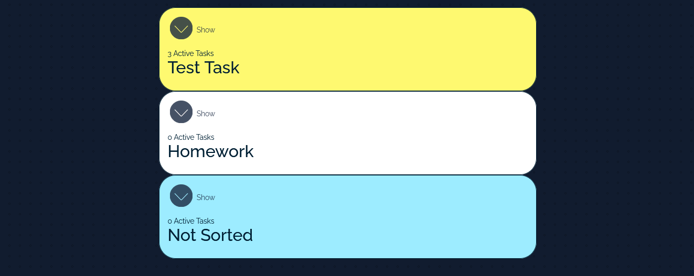
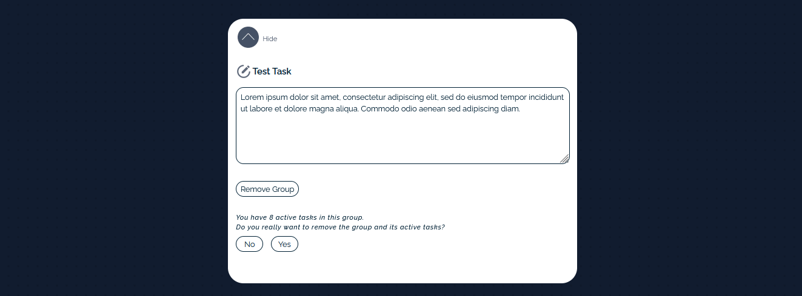

## Overview
This TODO application is a web-based task management system that allows logged-in users to create, view, update, and delete their tasks. Each task is associated with a user who created it and can be assigned to a group or remain ungrouped. Users can also create subtasks within a task using checkboxes. (Due to some limitations in time some operations like association between user id and task will be completed after reviewing of the work to be fair with deadline)

The backend of the application is built using Node.js, Express.js, Sequlize and the database is PostgreSQL.  Authentication and authorization is using JWT. The frontend is built with React, React-router, Redux, and SASS. The frontend and backend communicate through a RESTful API, which handles all CRUD operations for tasks and subtasks. Documentation of the API is build using Swagger and you reach it on your machine with endpoint "api/docs"

The main features of the application include:

- User authentication: Users can create accounts and log in to the system using their email and password. Once logged in, they can only see and manage their own tasks. ( Under construction )

-  Task management: Users can create, view, update, and delete their tasks. Each task has a title, description, date created and status. Tasks can be assigned to a group or remain ungrouped.
    
- Subtasks: Users can create subtasks within a task using checkboxes. Subtasks have a title and can be marked as completed or not.
    
- Group management: Users can create, view, update, and delete groups. Each group has a name, description (optional) and can contain multiple tasks.

- Responsive design: The application is designed to be responsive and can be used on both desktop and mobile devices.

## How to install

1.  Clone the repository:
    
    -   Go to your GitHub repository's main page.
    -   Click on the "Code" button and copy the repository's URL.
    -   Open your terminal or command prompt and navigate to the directory where you want to clone the repository.
    -   Run the following command: `git clone <repository URL>`
    -   This will create a new directory with the name of the repository on your local machine.
2.  Install dependencies:
    
    -   Navigate into the newly created directory.
    -   Run `npm install` to install the dependencies needed for both the server and client.
3.  Database setup:

    -   Install PostgreSQL and create a new database.
    - Go to /server/sequelize/congig/congig.json and enter your PostgreSQL credential (username, password, databese)
    - Got to /server/sequelize/ in your terminal and run the code `sequelize db:migrate`
5.  Starting the server:
    
    -   In the root directory of the project, run `npm run server` to run the server and `npm run client` to run the client.
6.  Open the application:
    
    -   Open your web browser and go to `http://localhost:3000` to see the application running.
    - Your server will run on `http://localhost:8000`

## Preview

- Authentication and authorization form
- 
- Header
-  
- Task List View
- 
- Active Task View
- 
- Add Task Form
- 
- Edit Task Form
- 
- Group LIst View
- 
- Active Group View
- 
- Add Group Form
- 
- Add Edit Form
- 